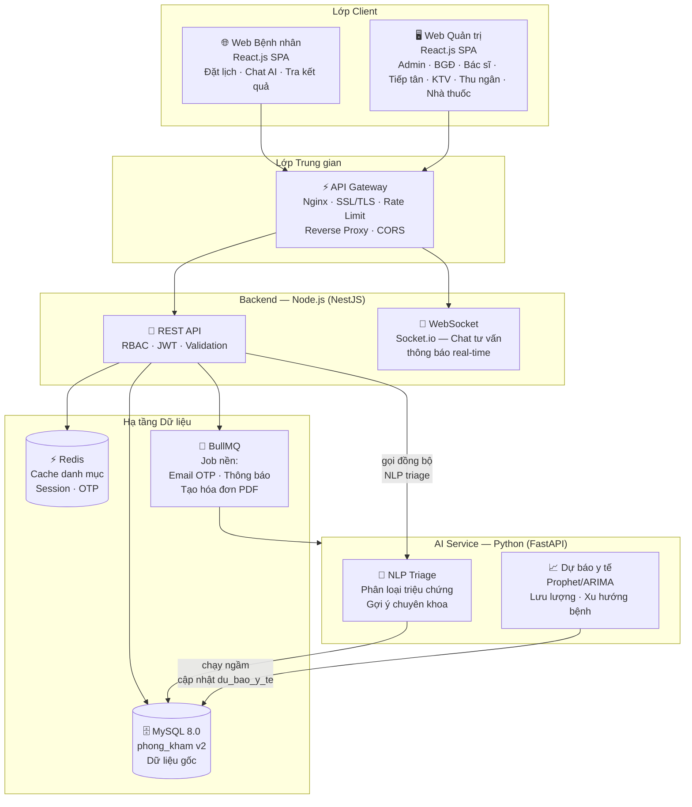

# Kiến trúc Hệ thống — Phòng Khám Đa Khoa

> Phiên bản thiết kế tổng thể · Schema v2 · React.js Frontend · Node.js Backend · AI Service Python

---

## 1. Sơ đồ kiến trúc tổng thể



---

## 2. Kiến trúc Backend — NestJS

> Chọn **NestJS** thay vì Express thuần vì: kiến trúc module rõ ràng, Dependency Injection, Decorator-based, phù hợp hệ thống lớn nhiều role.

### 2.1 Cấu trúc thư mục

```
backend/
├── src/
│   ├── main.ts                    ← Entry point, Swagger, CORS, Helmet
│   ├── app.module.ts              ← Root module
│   │
│   ├── config/                    ← Cấu hình (DB, JWT, Mail, Redis)
│   │   ├── database.config.ts
│   │   ├── jwt.config.ts
│   │   └── redis.config.ts
│   │
│   ├── common/                    ← Dùng chung toàn hệ thống
│   │   ├── decorators/            ← @Roles(), @CurrentUser(), @Public()
│   │   ├── guards/                ← JwtAuthGuard, RolesGuard
│   │   ├── interceptors/          ← ResponseTransform, Logging
│   │   ├── filters/               ← GlobalExceptionFilter
│   │   ├── pipes/                 ← ValidationPipe
│   │   └── utils/                 ← MaGenerator (BN000001), OTP, bcrypt
│   │
│   ├── modules/
│   │   ├── auth/                  ← Đăng nhập, OTP, refresh token
│   │   ├── nguoi-dung/            ← Quản lý tài khoản, RBAC
│   │   ├── nhan-vien/             ← Hồ sơ nhân viên, lịch làm việc
│   │   ├── benh-nhan/             ← CRUD bệnh nhân, tìm kiếm
│   │   ├── lich-hen/              ← Đặt lịch, optimistic lock, slot BS
│   │   ├── tiep-nhan/             ← Lượt tiếp nhận, sinh hiệu, hàng đợi
│   │   ├── benh-an/               ← Hồ sơ bệnh án, phiếu khám
│   │   ├── xet-nghiem/            ← Chỉ định, lấy mẫu, kết quả
│   │   ├── don-thuoc/             ← Kê đơn, FEFO xuất kho, lo_thuoc
│   │   ├── hoa-don/               ← Viện phí, thanh toán, PDF hóa đơn
│   │   ├── tu-van/                ← WebSocket phiên tư vấn + tin nhắn
│   │   ├── ai/                    ← Proxy đến AI Service Python
│   │   ├── thong-bao/             ← Push notification qua BullMQ
│   │   ├── bai-viet/              ← CMS bài viết sức khỏe
│   │   └── bao-cao/               ← Báo cáo thống kê, export Excel
│   │
│   └── database/
│       └── entities/              ← TypeORM Entities map schema v2
│
├── .env
├── package.json
└── nest-cli.json
```

### 2.2 Luồng xử lý Request chuẩn

```
Request → Nginx → NestJS
  → GlobalExceptionFilter (bắt lỗi)
  → JwtAuthGuard (xác thực token)
  → RolesGuard (kiểm tra vai_tro_quyen_han)
  → ValidationPipe (validate DTO)
  → Controller → Service → Repository (TypeORM)
  → ResponseTransformInterceptor (bọc response chuẩn)
  → Response: { success, data, message, timestamp }
```

### 2.3 Chuẩn Response API

```json
// Thành công
{
  "success": true,
  "data": { ... },
  "message": "Thao tac thanh cong",
  "timestamp": "2026-08-28T15:00:00+07:00"
}

// Lỗi nghiệp vụ
{
  "success": false,
  "error": {
    "code": "LICH_HEN_TRUNG_GIO",
    "message": "Bac si da co lich hen vao khung gio nay"
  },
  "timestamp": "..."
}

// Phân trang
{
  "success": true,
  "data": [...],
  "pagination": { "page": 1, "limit": 20, "total": 150, "totalPages": 8 }
}
```

---

## 3. Thiết kế API (REST)

### 3.1 Nhóm Xác thực `/api/auth`

| Method | Endpoint | Mô tả | Role |
|--------|----------|-------|------|
| POST | `/auth/login` | Đăng nhập → JWT | All |
| POST | `/auth/register` | Bệnh nhân tự đăng ký | Public |
| POST | `/auth/send-otp` | Gửi OTP email | Public |
| POST | `/auth/verify-otp` | Xác thực OTP | Public |
| POST | `/auth/refresh` | Làm mới access token | Auth |
| POST | `/auth/logout` | Đăng xuất (blacklist token) | Auth |

### 3.2 Nhóm Bệnh nhân `/api/benh-nhan`

| Method | Endpoint | Mô tả | Role |
|--------|----------|-------|------|
| GET | `/benh-nhan` | Tìm kiếm, lọc danh sách | tiep_tan, bac_si |
| POST | `/benh-nhan` | Tạo hồ sơ mới | tiep_tan |
| GET | `/benh-nhan/:id` | Xem chi tiết | tiep_tan, bac_si |
| PATCH | `/benh-nhan/:id` | Cập nhật thông tin | tiep_tan |
| GET | `/benh-nhan/:id/ho-so-benh-an` | Toàn bộ hồ sơ | bac_si |
| GET | `/benh-nhan/:id/lich-su-kham` | Lịch sử các lần khám | bac_si, benh_nhan |

### 3.3 Nhóm Lịch hẹn `/api/lich-hen`

| Method | Endpoint | Mô tả | Role |
|--------|----------|-------|------|
| GET | `/lich-hen` | Danh sách (lọc ngày/BS/TT) | tiep_tan, bac_si |
| POST | `/lich-hen` | Tạo lịch hẹn mới | tiep_tan, bac_si, benh_nhan |
| GET | `/lich-hen/slot-trong?bac_si_id&ngay` | Các slot còn trống của BS | All |
| PATCH | `/lich-hen/:id/trang-thai` | Xác nhận/Hủy/Hoàn thành | tiep_tan |
| DELETE | `/lich-hen/:id` | Hủy lịch hẹn | benh_nhan, tiep_tan |

### 3.4 Nhóm Tiếp nhận `/api/tiep-nhan`

| Method | Endpoint | Mô tả | Role |
|--------|----------|-------|------|
| GET | `/tiep-nhan/hang-doi?phong_kham_id` | Hàng đợi phòng khám | tiep_tan, bac_si |
| POST | `/tiep-nhan` | Tạo lượt tiếp nhận | tiep_tan |
| POST | `/tiep-nhan/:id/sinh-hieu` | Ghi sinh hiệu ban đầu | tiep_tan |
| PATCH | `/tiep-nhan/:id/phong-kham` | Điều phối vào phòng | tiep_tan |
| PATCH | `/tiep-nhan/:id/trang-thai` | Cập nhật trạng thái | tiep_tan, bac_si |

### 3.5 Nhóm Xét nghiệm `/api/xet-nghiem`

| Method | Endpoint | Mô tả | Role |
|--------|----------|-------|------|
| GET | `/xet-nghiem/chi-dinh?ktv_id` | Danh sách chỉ định | ky_thuat_vien |
| POST | `/xet-nghiem/chi-dinh` | Bác sĩ chỉ định | bac_si |
| PATCH | `/xet-nghiem/chi-dinh/:id/lay-mau` | Cập nhật trạng thái lấy mẫu | ky_thuat_vien |
| POST | `/xet-nghiem/chi-dinh/:id/ket-qua` | Nhập kết quả | ky_thuat_vien |
| PATCH | `/xet-nghiem/chi-dinh/:id/gui-bac-si` | Gửi kết quả cho bác sĩ | ky_thuat_vien |

### 3.6 Nhóm AI `/api/ai`

| Method | Endpoint | Mô tả | Role |
|--------|----------|-------|------|
| POST | `/ai/chat` | Gửi tin nhắn chat AI | benh_nhan, Public |
| GET | `/ai/chat/:phien_id` | Lịch sử phiên chat | benh_nhan |
| GET | `/ai/du-bao?loai&ky` | Xem dự báo y tế | ban_giam_doc |

---

## 4. AI Service — Python FastAPI

### 4.1 Kiến trúc

```
ai-service/
├── main.py                    ← FastAPI app, /health
├── routers/
│   ├── triage.py              ← POST /triage (NLP phân loại triệu chứng)
│   └── forecast.py            ← GET /forecast (dự báo định kỳ)
├── services/
│   ├── nlp_service.py         ← Xử lý NLP (mô hình + rules)
│   └── forecast_service.py    ← Prophet/ARIMA
├── models/
│   └── symptom_model/         ← Mô hình đã huấn luyện (.pkl)
├── schemas/
│   ├── triage_schema.py       ← Pydantic DTO
│   └── forecast_schema.py
└── requirements.txt
```

### 4.2 API AI Service

```
POST /triage
Body: { "trieu_chung": "đau đầu, sốt cao 3 ngày, mệt mỏi" }
Response: {
  "chuyen_khoa_goi_y": ["Nội tổng quát", "Truyền nhiễm"],
  "muc_do_khan_cap": "trung_binh",   // thap | trung_binh | cao | khan_cap
  "tu_khoa_phat_hien": ["sốt cao", "3 ngày"],
  "ghi_chu": "Cần thăm khám trong vòng 24h"
}

POST /forecast/run           ← BullMQ gọi định kỳ (cron)
GET  /forecast?loai=luu_luong_benh_nhan&ky=2026-09
```

### 4.3 Cơ chế tích hợp AI "vô hình"

```
Bệnh nhân nhập triệu chứng vào form đặt lịch
        ↓
NestJS gọi đồng bộ AI Service /triage (< 2 giây)
        ↓
Kết quả gợi ý chuyên khoa hiển thị ngay trên form
(không có chatbot nổi, không có animation rườm rà)
        ↓
Bệnh nhân xác nhận → tạo lịch hẹn
        ↓
Lịch sử lưu vào phien_chat_ai + tin_nhan_chat_ai
```

---

## 5. Frontend React.js — Healthcare Design System

### 5.1 Cấu trúc thư mục

```
frontend/
├── public/
│   └── index.html
├── src/
│   ├── main.jsx
│   ├── App.jsx                    ← Router setup, role-based routes
│   │
│   ├── design-system/             ← TOÀN BỘ component UI dùng chung
│   │   ├── tokens/
│   │   │   ├── colors.js          ← Medical Blue, Semantic Colors
│   │   │   ├── typography.js      ← Inter font, size scale
│   │   │   └── spacing.js         ← 4px grid system
│   │   ├── components/
│   │   │   ├── Card/              ← MedCard — thẻ bệnh nhân, lịch hẹn
│   │   │   ├── Badge/             ← StatusBadge (màu ngữ nghĩa)
│   │   │   ├── Button/            ← MedButton (primary/ghost/danger)
│   │   │   ├── Stepper/           ← MedStepper — quy trình tuyến tính
│   │   │   ├── VitalSign/         ← VitalDisplay — sinh hiệu lớn
│   │   │   ├── Table/             ← MedTable — danh sách bệnh nhân
│   │   │   ├── Form/              ← MedInput, MedSelect, MedDatePicker
│   │   │   ├── Modal/             ← ConfirmModal, DetailModal
│   │   │   └── Alert/             ← AllergyAlert (đỏ nổi bật)
│   │   └── layouts/
│   │       ├── DashboardLayout/   ← Sidebar + Header + Main
│   │       └── AuthLayout/        ← Layout đăng nhập
│   │
│   ├── portals/                   ← Mỗi portal = 1 nhóm role
│   │   ├── patient/               ← Web bệnh nhân (đặt lịch, chat AI)
│   │   ├── receptionist/          ← Tiếp tân
│   │   ├── doctor/                ← Bác sĩ
│   │   ├── lab-technician/        ← Kỹ thuật viên XN
│   │   ├── pharmacy/              ← Nhà thuốc
│   │   ├── cashier/               ← Thu ngân
│   │   └── management/            ← BGĐ / Quản lý
│   │
│   ├── hooks/
│   │   ├── useAuth.js             ← Auth state, token refresh
│   │   ├── useSocket.js           ← WebSocket kết nối
│   │   ├── useQueue.js            ← Hàng đợi real-time
│   │   └── usePagination.js
│   │
│   ├── store/                     ← Zustand (nhẹ hơn Redux)
│   │   ├── authStore.js
│   │   ├── queueStore.js          ← Hàng đợi phòng khám
│   │   └── notifStore.js          ← Thông báo
│   │
│   ├── services/                  ← Axios API calls
│   │   ├── api.js                 ← Axios instance + interceptors
│   │   ├── auth.service.js
│   │   ├── benhNhan.service.js
│   │   ├── lichHen.service.js
│   │   └── ...
│   │
│   └── utils/
│       ├── formatDate.js          ← Định dạng ngày giờ Việt Nam
│       ├── formatCurrency.js      ← Định dạng tiền VNĐ
│       └── constants.js           ← TRANG_THAI, LOAI_PHI...
│
├── package.json
└── vite.config.js
```

### 5.2 Design Token — Hệ thống màu sắc

```js
// design-system/tokens/colors.js
export const colors = {
  // Primary — Medical Blue
  primary: {
    50:  '#EFF6FF',   // Nền card nhạt
    100: '#DBEAFE',   // Hover nhẹ
    500: '#3B82F6',   // Màu chủ đạo button
    600: '#2563EB',   // Hover button
    700: '#1D4ED8',   // Active
  },

  // Neutral — Nền trắng & xám
  white:   '#FFFFFF',
  gray: {
    50:  '#F9FAFB',   // Nền trang
    100: '#F3F4F6',   // Nền sidebar
    200: '#E5E7EB',   // Viền card
    500: '#6B7280',   // Chữ phụ
    900: '#111827',   // Chữ chính
  },

  // Semantic — MÀU THAY THẾ TỪ NGỮ
  danger: {
    light: '#FEF2F2',
    main:  '#EF4444',   // 🔴 Dị ứng, Khẩn cấp, Hết hạn thuốc
  },
  warning: {
    light: '#FFFBEB',
    main:  '#F59E0B',   // 🟡 Đang chờ, Chú ý
  },
  success: {
    light: '#F0FDF4',
    main:  '#22C55E',   // 🟢 Bình thường, Đã thanh toán
  },
  info: {
    light: '#EFF6FF',
    main:  '#3B82F6',   // 🔵 Thông tin
  },
};
```

### 5.3 Component VitalSign — Hiển thị sinh hiệu

```jsx
// Sinh hiệu phải to hơn 1.5x, có màu ngữ nghĩa
<VitalDisplay
  label="Huyết áp"
  value="128/82"
  unit="mmHg"
  status="warning"      // → màu vàng + icon cảnh báo
  referenceRange="90–120 / 60–80"
/>

// Hiển thị: số "128/82 mmHg" — font-size: 2rem, font-weight: 700
// Label nhỏ ở trên, khoảng tham chiếu nhỏ ở dưới
```

### 5.4 Stepper — Quy trình tuyến tính Tiếp tân

```
[ ① Tìm bệnh nhân ] → [ ② Sinh hiệu ] → [ ③ Điều phối phòng ] → [ ④ Hoàn tất ]
      ✅ Xong               ⬤ Đang làm         ○ Chưa làm           ○ Chưa làm
```

```jsx
<MedStepper
  steps={['Tìm bệnh nhân', 'Sinh hiệu', 'Điều phối phòng', 'Hoàn tất']}
  currentStep={1}    // 0-indexed
/>
```

### 5.5 Màn hình chính theo từng Role

| Portal | Màn hình chính |
|--------|----------------|
| **Tiếp tân** | Danh sách lịch hẹn hôm nay + Stepper tiếp nhận + Hàng đợi |
| **Bác sĩ** | Queue bệnh nhân chờ + Phiếu khám + Lịch tư vấn |
| **KTV XN** | Danh sách chỉ định cần xử lý + Form nhập kết quả |
| **Nhà thuốc** | Đơn thuốc chờ duyệt + Phát thuốc FEFO |
| **Thu ngân** | Bệnh nhân chờ thanh toán + Hóa đơn + Xuất PDF |
| **BGĐ** | Dashboard KPI + Biểu đồ + Dự báo AI |
| **Bệnh nhân** | Đặt lịch (có AI gợi ý) + Kết quả XN + Hồ sơ |

---

## 6. WebSocket — Hàng đợi & Chat tư vấn real-time

```
// NestJS Gateway (Socket.io)
Sự kiện phát ra:
  queue:update       ← Tiếp tân điều phối → Bác sĩ thấy BN mới
  xn:result_ready    ← KTV gửi KQ → Bác sĩ thấy ngay
  notification:new   ← Push thông báo đến user cụ thể
  tuvan:message      ← Tin nhắn chat tư vấn
```

---

## 7. Packages chính

### Backend (NestJS)
```
@nestjs/core, @nestjs/common, @nestjs/jwt, @nestjs/passport
@nestjs/typeorm, mysql2
@nestjs/websockets, socket.io
@nestjs/bull, bull               ← Job queue
ioredis                          ← Redis client
class-validator, class-transformer
nodemailer                       ← Email OTP
multer, @aws-sdk/client-s3       ← Upload file (hoặc local)
exceljs                          ← Xuất báo cáo Excel
```

### Frontend (React + Vite)
```
react, react-dom, react-router-dom
axios                            ← HTTP client
zustand                          ← State management (nhẹ hơn Redux)
socket.io-client                 ← WebSocket
react-query (@tanstack/react-query) ← Server state, cache, refetch
react-hook-form + zod            ← Form + validation
recharts                         ← Biểu đồ báo cáo BGĐ
date-fns                         ← Xử lý ngày giờ
@headlessui/react                ← Modal, Dropdown accessible
lucide-react                     ← Icon set y khoa
```

### AI Service (Python)
```
fastapi, uvicorn
underthesea                      ← NLP tiếng Việt
scikit-learn                     ← Phân loại triệu chứng
prophet                          ← Dự báo chuỗi thời gian
sqlalchemy + pymysql             ← Kết nối MySQL để ghi du_bao_y_te
pydantic                         ← Schema validation
```

---

## 8. Thứ tự implement

```
Sprint 1 (Nền tảng)
  ✦ Setup NestJS + TypeORM + MySQL v2
  ✦ Module Auth (JWT, OTP, RBAC)
  ✦ Design System React (colors, Card, Button, Stepper)
  ✦ Layout Dashboard + Login page

Sprint 2 (Luồng tiếp nhận)
  ✦ Module Bệnh nhân (CRUD)
  ✦ Module Lịch hẹn (đặt lịch, slot)
  ✦ Module Tiếp nhận (sinh hiệu, điều phối)
  ✦ WebSocket hàng đợi

Sprint 3 (Khám bệnh)
  ✦ Module Bệnh án / Phiếu khám
  ✦ Module Xét nghiệm (chỉ định → KTV → kết quả)
  ✦ Module Đơn thuốc + FEFO xuất kho

Sprint 4 (Hoàn thiện)
  ✦ Module Thanh toán + PDF hóa đơn
  ✦ Module Báo cáo + biểu đồ BGĐ
  ✦ AI Service Python (NLP triage)
  ✦ Tư vấn trực tuyến WebSocket

Sprint 5 (Nâng cao)
  ✦ Thông báo BullMQ
  ✦ Dự báo AI định kỳ
  ✦ CMS bài viết
  ✦ Web bệnh nhân (đặt lịch online)
```
